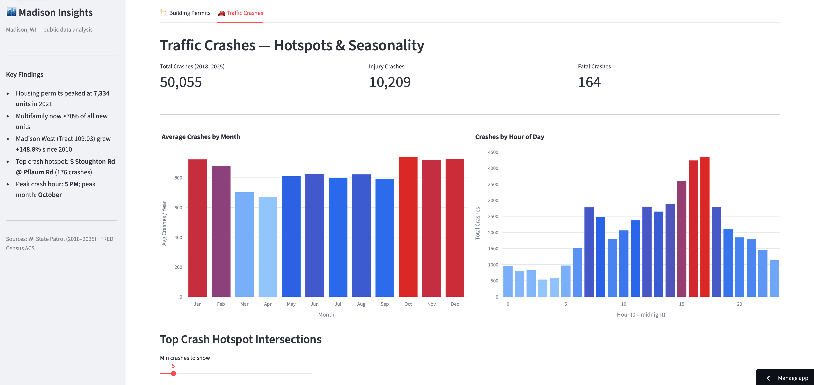
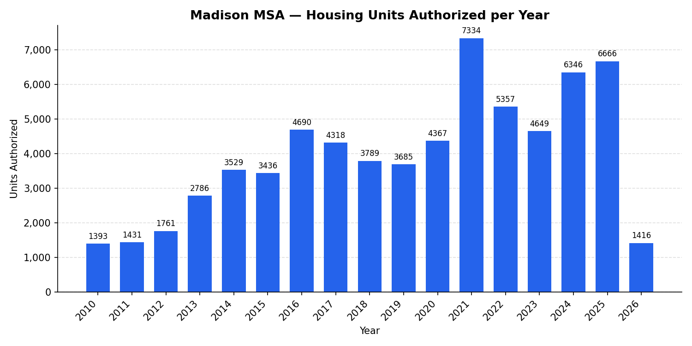
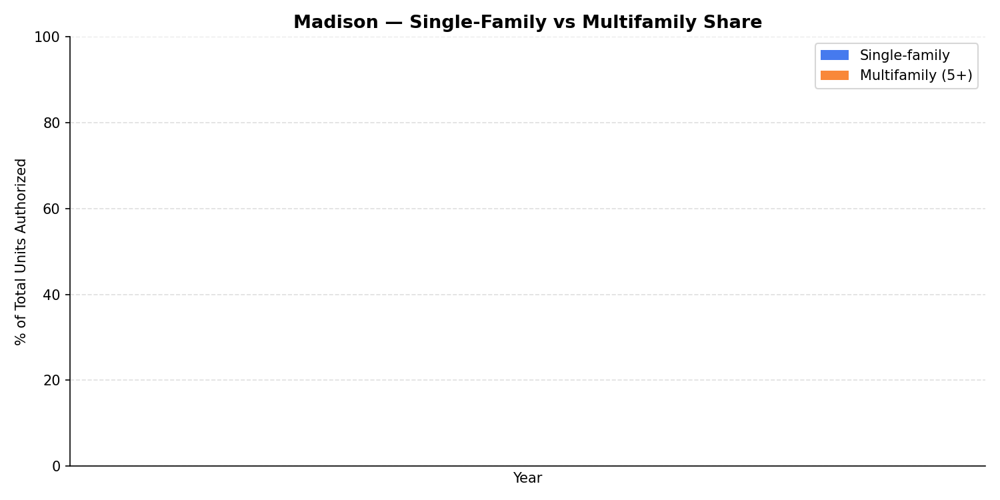
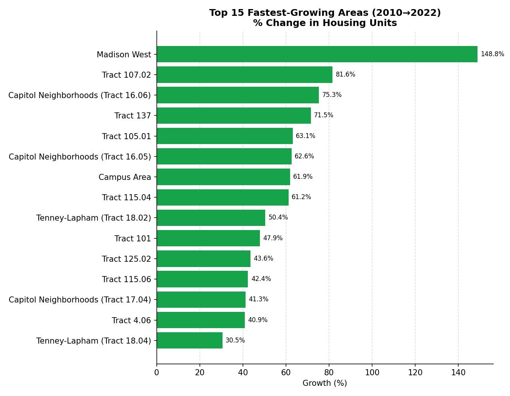
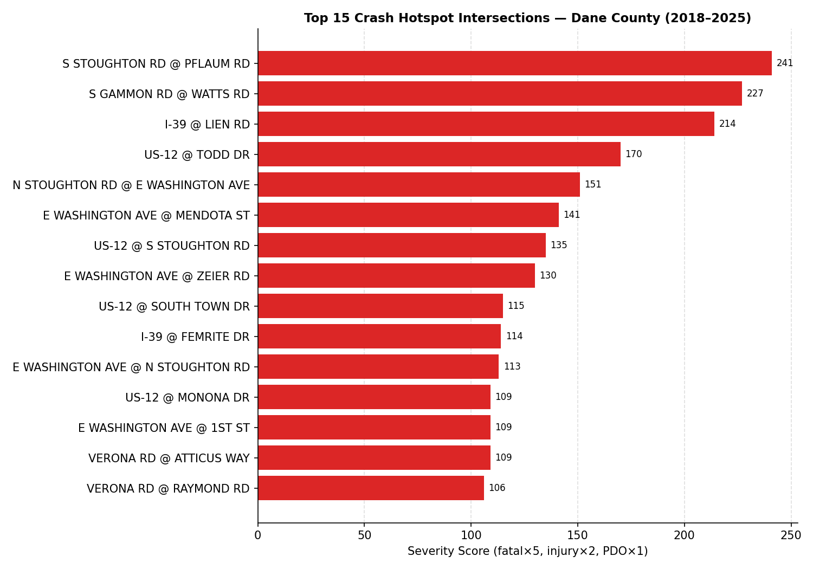
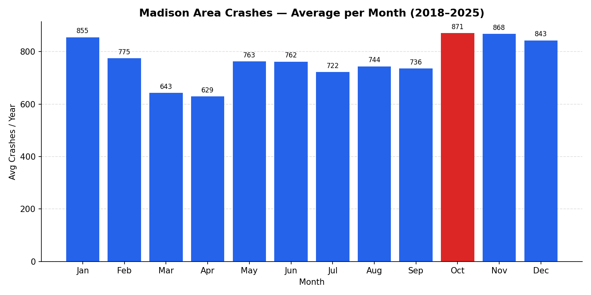

# Madison Insights

An end-to-end data engineering and analytics project covering traffic safety and housing growth in Madison, WI. Pulls from three public sources, loads ~74K crash records and 38 years of permit data into PostgreSQL, and surfaces findings through an interactive Streamlit dashboard deployed on Streamlit Community Cloud.



**Live demo:** [madison-insights.streamlit.app](https://madison-insights.streamlit.app)

---

## Questions It Answers

**Housing & Permits**
- How has Madison's construction pace changed since 1988 — and where did it peak?
- Is new housing skewing toward single-family or multifamily?
- Which neighborhoods added the most housing units between 2010 and 2024?

**Traffic Safety**
- Which intersections are the most dangerous by severity-weighted score?
- When do crashes peak — by month, day of week, and hour?
- Where are crash clusters concentrated on a map?

---

## Key Findings

### Building Permits
Madison MSA authorized **7,334 units in 2021** — a 5× increase from the 2010–2012 post-recession floor. Multifamily (5+ units) now drives over **70% of new construction**, a structural shift from the pre-2015 mix. At the tract level, **Madison West grew +148.8% in housing units** since 2010, followed by Capitol Neighborhoods (+75%) and the Campus Area (+62%).

### Traffic Crashes
Across 73,691 Dane County crashes (2018–2025), **S Stoughton Rd @ Pflaum Rd** ranks as the most dangerous intersection by severity score (fatal×5, injury×2, PDO×1). **October** is the peak crash month; the **5 PM hour** accounts for the most crashes of any single hour. E Washington Ave appears four times in the top 15 hotspots.

---

## Dashboard Features

| Tab | Features |
|---|---|
| **Building Permits** | Annual trend with year-range slider · SF vs. multifamily share · Top N fastest-growing neighborhoods · Geographic choropleth (percentile-clipped color scale) |
| **Traffic Crashes** | Monthly seasonality · Hourly distribution · Severity-weighted hotspot chart · Interactive Folium heatmap · Intersection drill-down (year trend, hour-of-day, severity breakdown) |

---

## Data Sources

| Dataset | Source | Coverage |
|---|---|---|
| WI State Patrol Crash Records (DT4000) | [WisDOT Box](https://wisdot.box.com) + [WisTransPortal API](https://transportal.cee.wisc.edu) | 2018–2025, Dane County (73,691 records) |
| Building Permits (FRED) | [FRED MADI555BP1FH](https://fred.stlouisfed.org) | 1988–present, Madison MSA (459 months) |
| Census Tract Housing Units (ACS 5-yr) | [Census API](https://api.census.gov) | 2010 + 2024, 125 Dane County tracts |
| Madison Neighborhood Associations | [City of Madison GIS](https://maps.cityofmadison.com) | 141 polygon boundaries |
| Census Tract Boundaries (TIGER) | [Census TIGERweb](https://tigerweb.geo.census.gov) | Dane County interior points |

---

## Technical Highlights

- **Dual ingestion pipeline** — ZIP/CSV loader for 2018–2022 historical data; concurrent REST API fetcher (20 workers, ~2 min/year) for 2023–2025 via WisTransPortal ArcGIS GP service
- **Severity-weighted hotspot ranking** — composite score (fatal×5, injury×2, PDO×1) surfaces genuinely dangerous intersections rather than high-volume low-severity ones
- **Pure-Python spatial join** — ray-casting point-in-polygon maps 142 Census tracts to Madison neighborhood names via three fallback layers (Neighborhood Associations → Aldermanic Districts → TIGER Places)
- **Zero-dependency deployment** — PostgreSQL replaced with DuckDB reading committed Parquet files; runs on Streamlit Community Cloud with no secrets or hosted DB

---

## Stack

| Layer | Tools |
|---|---|
| Data ingestion | Python, `urllib`, `pandas`, `psycopg2` |
| Storage | PostgreSQL (local dev) → Parquet (deployment) |
| Query engine | DuckDB |
| Visualization | Plotly, Folium, Streamlit |
| Spatial | Pure-Python ray casting, Census TIGER REST API |

---

## Screenshots











---

## How to Run

### Quick start (pre-built data)

```bash
git clone https://github.com/suheum-heo/madison-insights
cd madison-insights
python3 -m venv .venv && source .venv/bin/activate
pip install -r requirements.txt
streamlit run app.py
```

The app reads from committed Parquet files in `data/` — no database or API keys required.

### Rebuild from source

Requires PostgreSQL and a free [Census API key](https://api.census.gov/data/key_signup.html).

```bash
# 1. Create database and schema
psql -c "CREATE DATABASE madison_analysis"
psql madison_analysis -f scripts/01_create_schema.sql

# 2. Load data
python3 scripts/02_download_crashes.py          # WI State Patrol ZIPs (2018–2022)
python3 scripts/11_download_crashes_api.py      # WisTransPortal API (2023–2025)
python3 scripts/03_download_permits.py --census-key YOUR_KEY

# 3. Neighborhood spatial join
python3 scripts/09_neighborhood_mapping.py

# 4. Export to Parquet
python3 scripts/10_export_parquet.py

# 5. Launch
streamlit run app.py
```

---

## Repository Structure

```
madison-insights/
├── app.py                        # Streamlit dashboard
├── data/                         # Parquet files (crashes, permits, tracts)
├── charts/                       # Static chart PNGs + Folium HTML map
├── scripts/
│   ├── 01_create_schema.sql
│   ├── 02_download_crashes.py    # Historical crash ZIPs (2018–2022)
│   ├── 03_download_permits.py    # FRED + Census ACS
│   ├── 09_neighborhood_mapping.py
│   ├── 10_export_parquet.py
│   └── 11_download_crashes_api.py  # API-based crash fetch (2023–2025)
└── requirements.txt
```
